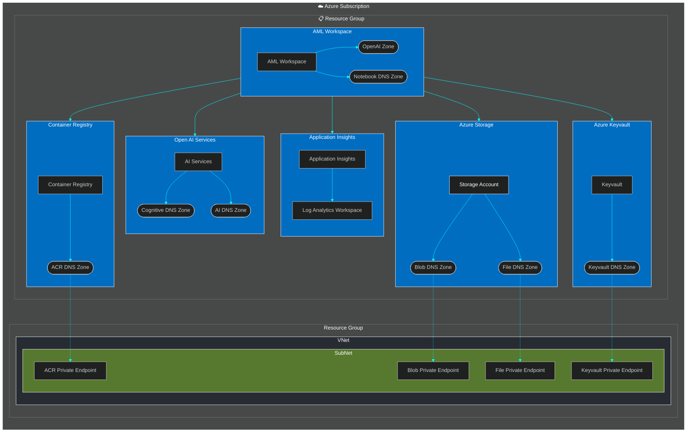

<!-- YAML front-matter schema: https://review.learn.microsoft.com/en-us/help/contribute/samples/process/onboarding?branch=main#supported-metadata-fields-for-readmemd -->

> [!NOTE]
> This repository is a starter kit to use as a base to provision AI powered applications.

# Azure Open AI and ML Workspace provisioning

[](placeholder)
[](placeholder)

# Overview

This project deploys Azure Open AI and a Machine Learning workspace on Azure using Bicep templates. The templates automate the creation of necessary resources and configurations to get started with Azure AI services.

## Features
This Bicep template defines a module for deploying an Azure Machine Learning (AML) workspace. Let's break down the key parts of this excerpt:

1. **Parameters Section**:
   - The parameters section is not shown in the excerpt, but it typically defines the inputs required for the template.

2. **Module Definition**:
   - The `module` keyword is used to define a reusable component. In this case, it is deploying an AML workspace using another Bicep file located at `'core/aml/aml-workspace.bicep'`.

3. **Module Properties**:
   - `name`: The name of the deployment, which is dynamically set using the `amlName` parameter.
   - `scope`: The scope of the deployment, set to the resource group (`rg`).

4. **Module Parameters**:
   - `amlWorkspaceName`: The name of the AML workspace.
   - `customNetworkInterfaceName`: The name of the custom network interface.
   - `location`: The location where the resources will be deployed.
   - `tags`: Tags to be applied to the resources.
   - `containerRegistryId`: The resource ID of the container registry.
   - `keyVaultId`: The resource ID of the Key Vault.
   - `storageAccountId`: The resource ID of the storage account.
   - `aiServicesId`: The resource ID of the AI services.
   - `aiServicesTarget`: The target for the AI services.
   - `applicationInsightsId`: The resource ID of the Application Insights.
   - `vnetResourceId`: The resource ID of the virtual network.
   - `subnetResourceId`: The resource ID of the subnet.


This template defines the necessary parameters and uses them to configure the AML workspace module. Make sure to replace the placeholder paths and parameter values with actual values relevant to your deployment.


This project framework provides the following features:

* Using Azure Deeloper CLI - `azd`
* Using Azure Verofied modules (aka `avm`)

### Architecture Diagram (Mermaid chart)

## Getting Started

To get started with this project, follow the instructions in the sections below to set up your environment and deploy the resources.


  * We recommend using NorthEurope

### GitHub Codespaces

You can run this template virtually by using GitHub Codespaces. The button will open a web-based VS Code instance in your browser:

1. Open a terminal window
2. Sign into your Azure account:

    ```shell
     azd auth login --use-device-code
    ```
3. Provision the Azure resources and deploy your code:

    ```shell
    azd up
    ```
4. Configure a CI/CD pipeline:

    ```shell
    azd pipeline config
    ```

### Local Environment

### Prerequisites

Before you begin, ensure you have the following installed:

* [Azure CLI](https://docs.microsoft.com/cli/azure/install-azure-cli)
* [Bicep CLI](https://docs.microsoft.com/azure/azure-resource-manager/bicep/install)
* [Azure Developer CLI (azd)](https://aka.ms/install-azd)

## Quickstart

1. Sign into your Azure account:

    ```shell
     azd auth login
    ```

2. Provision and deploy the project to Azure:

    ```shell
    azd up
    ```

3. Configure a CI/CD pipeline:

    ```shell
    azd pipeline config
    ```

### Extending Bicep IaC files

Once the application is developed, the Bicep files may need to be extended with additional service modules and configuration.

> [!IMPORTANT]
> This script needs the [Azure CLI] to be installed in your system or available in your setup.

## Contents

This repository contains the following Bicep files:

| File | Purpose |
|------|---------|
| `infra/main.bicep` | Main Bicep file that orchestrates the deployment of all resources. |
| `infra/main.bicepparam` | Main Bicep file parameterss. |
| `infra/appreviations.json` | naming convention json files|
| `infra/core/acr/containerregistry.bicep` | ACR deployment modules|
| `infra/core/ai/cognitiveservices.bicep` | AI Cognitive Service workspace modules|
| `infra/core/aml/aml-workspace.bicep` | AML Workspace modules|
| `infra/core/monitoring/appinsights.bicep` | Log Analytics workspace and App Insights|
| `infra/core/security/keyvaault.bicep` | Keyvault modules|
| `infra/core/storage/storage.bicep` | Azure storage modules|
|||

### Region Availability

  * We recommend using NorthEurope


## Credits
###### Author : Pinaki Ghatak - Sr. CSA - Microsoft. Last Update : 19-Jan-2025

